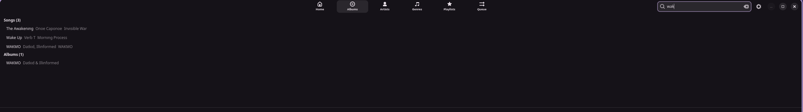

# Seesow Music

A modern, lightweight music player for Linux — built with GTK4 and libadwaita.


---

## Features

- **Home Dashboard** — Your Mix smart playlist, Recently Played, Favourite Albums and Favourite Artists all in one place
- **Albums** — Browseable grid with sortable views (by title, artist or year) and full album detail pages
- **Artists** — Artist list with per-artist song views and like support
- **Genres** — Browse your library by genre
- **Playlists** — Create, rename, delete and play playlists; save the current queue as a playlist in one click
- **Queue** — Drag-and-reorder play queue with duration totals
- **Smart Playlist** — "Your Mix" is automatically generated from your likes, recently played and most played tracks
- **Cover Art** — Automatically extracted from audio file tags and cached locally
- **Like System** — Like individual songs, albums and artists; likes feed into Your Mix
- **Search** — Instant search across songs, albums and artists
- **Keyboard Shortcuts** — Full keyboard control (see below)
- **Library Scanner** — Quick scan (new files only) and full scan with progress tracking
- **Multi-artist Support** — Configurable artist separator for tracks with multiple artists
- **Completely Free** — No ads, no tracking, no subscription

---

## Screenshots

| Albums | Album Details | Artist Details |
|--------|--------------|----------------|
|  |  |  |

| Playlists | Smart Playlists | Search |
|-----------|----------------|--------|
|  |  |  |

| Context Menu |
|-------------|
|  |

---

## Requirements

### System Dependencies

You will need the following installed on your system before running Seesow Music.

**Ubuntu / Debian**
```bash
sudo apt install python3 python3-gi python3-gi-cairo gir1.2-gtk-4.0 \
  gir1.2-adw-1 gir1.2-gst-1.0 gir1.2-gstpbutils-1.0 \
  gstreamer1.0-plugins-base gstreamer1.0-plugins-good \
  gstreamer1.0-plugins-bad gstreamer1.0-plugins-ugly \
  gstreamer1.0-libav
```

**Fedora**
```bash
sudo dnf install python3 python3-gobject gtk4 libadwaita \
  gstreamer1 gstreamer1-plugins-base gstreamer1-plugins-good \
  gstreamer1-plugins-bad-free gstreamer1-plugins-ugly-free \
  gstreamer1-plugin-libav
```

**Arch Linux**
```bash
sudo pacman -S python python-gobject gtk4 libadwaita \
  gstreamer gst-plugins-base gst-plugins-good \
  gst-plugins-bad gst-plugins-ugly gst-libav
```

> **Packaging support** (Flatpak, AppImage, `.deb`, `.rpm`) is planned for a future release.

---

## Installation

Clone the repository:

```bash
git clone https://github.com/banicans/SeesowMusic.git
cd SeesowMusic
```

---

## Running

```bash
python3 main.py
```

---

## Getting Started

1. Open **Settings** (gear icon in the top-right corner)
2. Click **Add Folder** and select the folder(s) where your music is stored
3. Click **Quick Scan** — Seesow Music will scan your folders and import your library
4. Close Settings and start listening

> Use **Full Scan** if you want to re-import metadata for your entire library (e.g. after updating tags).

---

## Keyboard Shortcuts

| Key | Action |
|-----|--------|
| `Space` | Play / Pause |
| `←` | Previous track |
| `→` | Next track |
| `Ctrl+F` | Focus search |
| `Escape` | Close search |
| `Ctrl+Q` | Quit |

---

## Supported Formats

| Format | Extension |
|--------|-----------|
| MP3 | `.mp3` |
| FLAC | `.flac` |
| AAC | `.aac`, `.m4a` |
| OGG Vorbis | `.ogg` |
| Opus | `.opus` |
| WAV | `.wav` |
| WMA | `.wma` |

---

## How It Works

Seesow Music scans your chosen music folders using **GStreamer's Discoverer** to read audio metadata (title, artist, album, track number, year, genre) and extract embedded cover art. Everything is stored in a local **SQLite database** at `~/.local/share/seesow-music/library.db`. Cover art is cached at `~/.cache/seesow-music/covers/`.

Play history and likes are recorded locally and used to power the **Your Mix** smart playlist, which pulls from your liked songs, liked albums, liked artists, recently played and most played tracks — with per-artist and per-album caps to keep things varied.

No data ever leaves your machine.

---

## License

Seesow Music is free and open source software, released under the [MIT License](LICENSE).

---

## Contributing

Contributions, bug reports and feature requests are welcome. Open an issue or pull request on [GitHub](https://github.com/banicans/SeesowMusic).
